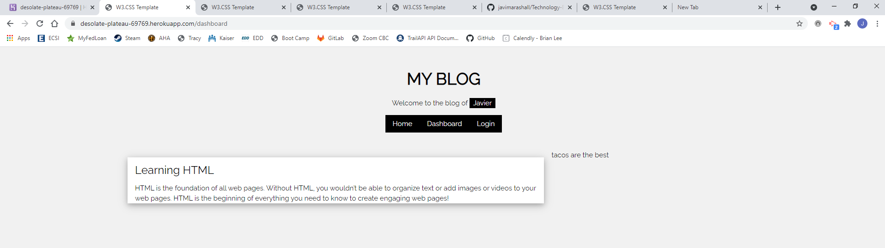

# Technology-Blog

## Summary
This software contains a technology blog application meant for users to post blog entries and be able to comment on other blog entries. The application has been deployed to heroku for users to be able to use it as it is a full stack web application. When a user loads the application on the browser, the application displays a home page with previous blog post. The application also has a login page for users to be able to sign in or new users can create a new username and password. Once the user has login to the application, the user is now able to view the contents of the dashboard section of the page. The user is also able to make updates to any of the previous post that user made and also delete posts. So the authentication now allows users to be able to navigate through the page as they wish.

## Site



## Technologies Used

* HTML - Used for building the site
* Javascript - Used to write in Node
* Package.json - Used to identify the project and the dependencies
* Package-lock.json - Automatically created for operations where npm modifies  package.json
* Node.js - Used to to write server-side application
* Npm - Used to obtain software packages
* GitHub - Used as the repository
* MySQL - A database management system
* Console.table - Used to print mysql rows to the console
* Sequelize - A Mysql framework
* Insomnia - Used to test API routes

## Code Snippet
This code snippet represents the code used for for creating a user. I included this code because it it was something new that I learned.

```javascript
router.post('/', async (req, res) => {
    console.log("********hit", req.session);
    try {

        const newUser = await User.create({
            //set the username to user input of username
            username: req.body.username,
            //set the password to the user input password
            password: req.body.password,
        });
        req.session.save(() => {
            //save the new username as username
            req.session.username = newUser.username;
            //save the logged in session
            req.session.loggedIn = true;
            //save the session with a user if
            req.session.userId = newUser.id;

            res.json(newUser);
        });
       
    } catch (err) {
        console.log("******",err);
        res.status(500).json(err);
    }
});
```
## Repository Link
https://github.com/javimarashall/Technology-Blog

## Heroku
https://desolate-plateau-69769.herokuapp.com/

## Video Link
https://drive.google.com/file/d/1eiLX9qLtJ1KMwkTSbLyf514ZV4cOZy2C/view
## Personal Links
[Github](https://github.com/javimarashall)<br>
[Linkedin](https://www.linkedin.com/in/javier-mondragon-7b471719b/)
